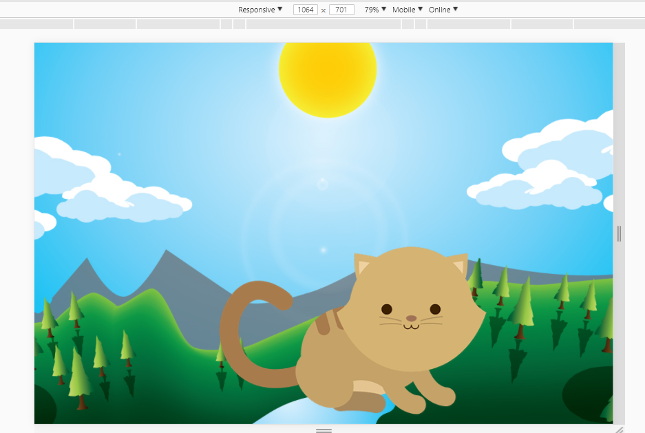
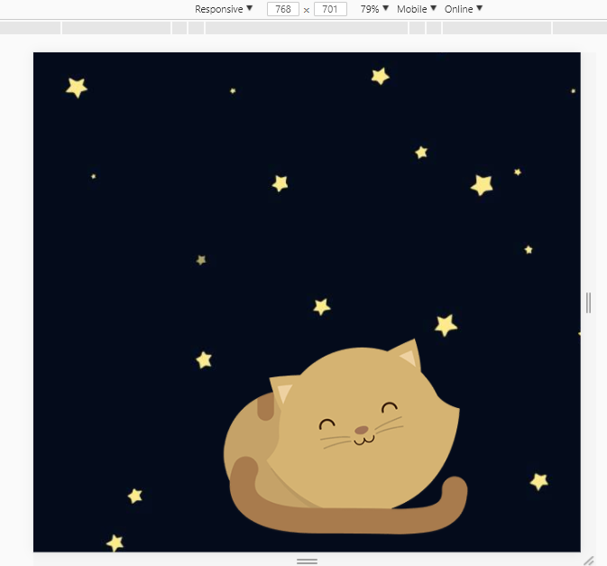
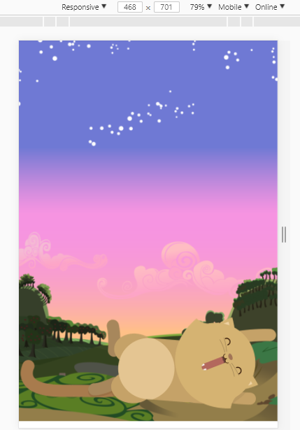

## RETO DE CODIGO KITTEN  

Track: Common Core.  
Curso: Crea tu propia red social.  
Unidad: La web desde un móvil.

### Objetivo

En el siguiente trabajo se realizo una web responsive en la cual se muestra un paisaje y un gatito diferente a medida que la ventana del navegador se haga más pequeña.  

### Herramientas  
Se utilizó:

- CSS (Grid System & @Media Queries)
- HTML

### Producto Final

